  
  <!-- Vertical Full-Body Profile Card with Door Opening Animation -->
  
  
    

  <!-- LeetCode Metrics Card & GitHub Stats Card -->
  

    
    &nbsp;&nbsp;
    
  

   

  <!-- Custom Animated Capsule Buttons -->
  

    
    &nbsp;&nbsp;
    
    &nbsp;&nbsp;
    
  

