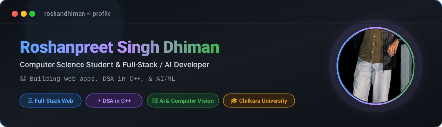

  <!-- Main Banner SVG with Embedded Circle Avatar -->
  

    

  <!-- Single Consolidated Action Buttons -->
  

    
    &nbsp;&nbsp;
    
    &nbsp;&nbsp;
    
    &nbsp;&nbsp;
    
  

 

  <!-- Developer Terminal / Specs Card -->
  

  

<!-- Tech Stack & Skills -->
<h2 align="center">🛠️ Tech Stack &amp; Skill Set</h2>

  <b>Languages:</b> 
  
  
  
  
  
  

  <b>Web &amp; Frameworks:</b> 
  
  
  
  
  

  <b>Databases, AI &amp; Tools:</b> 
  
  
  
  
  

  

<!-- Statistics -->
<h2 align="center">📊 GitHub Statistics</h2>

  <!-- GitStat Card -->
  

    
  

